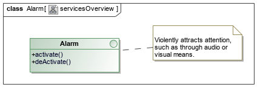

# Minimalist OSGi / Karaf example from first principles

This project shows how to decompose a system into basic
responsibilities with contracts (interfaces), and implement
those using OSGi bundles that exhibit strong run-time modularity.

In order to get the most out of this project, it's recommended
to run through the **16 steps** by checking out, in sequence,
the git tags called `1`, `2`, ... `16`.

> This project was presented as a live-coding demonstration
> at **Devcon Mauritius 2016**. It is not intended as a self-contained
> OSGi tutorial, but should be read after studying basic OSGi concepts.
> Any reasonable Java developer will be able to run through the 16
> steps presented and understand most of the concepts, though.

# Project setup

1. Recommend you open the project in a good IDE like IntelliJ IDEA
   (Project -> New -> From existing sources), picking "Maven" as
   the model when asked.
2. Download and unzip Apache Karaf (or any compatible OSGi container)
3. Get comfortable with running Karaf, and entering commands
   in the Karaf console.

# Step-by-step

In order to follow along, run the git command to check out 
each step. Since this document is only checked-in to the
Git repo at the end, be sure to make a copy, or to browse
it online on Github before starting :-)

## 1 : Blank maven project

`git checkout 1`

A blank project directory, with a starting `pom.xml` to configure
our Java build.

## 2 : Defining our service contracts (API)

`git checkout 2`

Our use-case is one of **monitoring an environment** for excessive
temperature, in which case we raise an alarm. Both the problem
and solution space have been simplified to absurdity, in order to
cover the fundamentals in-depth in a short, live session.

We've designed a set of services from first principles
using a technology-neutral analysis and design process like URDAD, 
after which we express our concepts in UML, which we 
then map to Java in this step.

Our functional requirements are the following:

We assign each responsibility to a services contract:

The three services contracts that we map to Java in this step
looks as follows:

In particular, our `performSurvey` service contract looks like:

Take a look at the Java contracts inside `envmon.api` for full details.
This is a plain old Java JAR, nothing special.

## 3 : Making our API a valid OSGi bundle

`git checkout 3`

And OSGi bundle is a JAR file, with metada that carefully controls
what code is shared with the environment, and what is kept private.

Careful per-package versioning, adhering to [semver](http://semver.org/), is
very important.

Instead of setting this metadata manually in the JAR manifest, we use
the **Maven Bundle Plugin** to do this.

To see the detailed changes made in this (or any other) step,
run: `git diff 2 3`, and examine the changes made to the Maven POMs.

After running `mvn install`, check out the contents of the JAR manifest
inside `envmon.api/target/classes/META-INF/MANIFEST.MF`

## 4 : Beginnings of an implementation, unit tests

`git checkout 4`

In `envmon.impl`, we introduce a stub for an implementation, 
`EnvironmentMonitorImpl`. Before actually implementing any of 
the methods, which you will see are currently
empty, we specify the desired behaviour in the form of executable
unit tests.

Note that our implementation simply declares references to what it
needs via private, volatile fields that refer to interfaces.

*Test-driven development* allows us to very precisely specify
requirements in a way that simple documentation can't. Take a look
at `envmon.impl/src/test/java/.../EnvironmentMonitorImplTest.java`

We often express the **collaboration context** as follows:

When you run `mvn install` (or `mvn test` specifically) you will see that
our unit test suite fails.

## 5 : Basic implementation (passes test)

`git checkout 5`

We implement, in a very basic way, `EnvironmentMonitorImpl` such that our unit
test pass.

Note that we are now **done** implementing `EnvironmentMonitorImpl`, without
there even existing implementations of the required services (`Alarm` and `Sensor`).

Developing modular systems in this way means that teams can concurrently develop
large systems, without bottlenecks or having to build bottom-up, yet having
a high degree of confidence that things will work as expected.

## 6 : Making our implementation an OSGi bundle

`git checkout 6`

Observe the changes made to the Maven `pom.xml` to ensure that the
implementation, like the API, is a valid OSGi bundle. For now, we
carefully and explicitly control what we depend on (which packages
we import). There are other options, discussed later on.

We will strictly adhere to [semantic versioning](http://semver.org/)
from this point on, to deal correctly with on-the-fly upgrade of
bundles while they are running. OSGi is designed for always-on,
hot-update systems, and this costs some complexity in terms of
versioning and metadata.

After building (`mvn install` in project root), we can deploy
our bundles to Karaf if we like. Note that we separately deploy
our API and our implementation:

> TODO: Write Deployment / running instructions

## 7 : Making an OSGi service, wiring up to dependencies

`git checkout 7`

In the previous step, we deployed some code to OSGi, but nothing
happened. Nothing told the environment which services to expose
as **services** to the environment, and which other services to
wire them up to.

There are a large number of options in OSGi to do this, including:

* Declarative services (scr)
* Blueprint
* iPojo
* Manually
* Felix Dependency Manager

I like the fact that Felix DM allows me to express service configuration
in a strongly-typed, compiled language, without polluting my actual
services with annotations etc.

In this step, we introduce a **bundle activator** that tells Felix DM
to expose our `EnvironmentMonitorImpl` as a service, and to wire it
up to any `Alarm` or `Sensor` in the environment.

See: `EnvironmentMonitorActivator.java`

> TODO: Write Deployment / running instructions

## 8 : Simple Alarm implementation

`git checkout 8`

We implement a simple **Alarm** service bundle, in `alarm.basic`

> TODO: Write Deployment / running instructions

## 9 : Making alarm directly controllable via Karaf console

`git checkout 9`

Just to show that our silly alarm works, we provide it with a direct "switch"
in the form of a Karaf Console command, `AlarmShellCommand.java`. This allows
a user to manually activate / deactivate the alarm.

Later, or course, our `EnvironmentMonitorImpl` will do so in response
to extreme temperature situations.

> TODO: Write Deployment / running instructions

## 10 : Simple sensor implementation

`git checkout 10`

In `sensor.basic`, we write a trivial sensor that randomly returns a reading
between two fixed temperatures.

> TODO: Write Deployment / running instructions

You will note that we independently deploy / upgrade the three components:

* EnvironmentMonitor
* Alarm
* Sensor

and that we deployed the EnvironmentMonitor long before an alarm or sensor even
existed. Yet, the moment both an alarm and a sensor is available in the environment,
it immediately "springs into action" (is available as a service).

Similarly, if no alarm or sensor is present, it is itself disabled.
Play with the service dynamics by enabling / disabling the different components.

On the Karaf Console, the Felix Dependency Manager also tells us about the
dependencies of a service, and why, for example, a service is not available.

## 11 : Make EnvironmentMonitor controllable via Karaf console

`git checkout 11`

Since we don't have any other kind of UI (user interface), we add a simple
Karaf Shell command to interact with our `EnvironmentMonitor`.

See: `PerformSurveyShellCommand.java`

> TODO: Write Deployment / running instructions

## 12 : Rounding out EnvironmentMonitor (rest of the services)

`git checkout 12`

In this step, we round out `EnvironmentMonitorImpl` by implementing
the rest of the services - such as starting / stopping time-based
environment polling (`startMonitoring()`/`stopMonitoring()`).

We implement these also in a test-driven manner, and finally add
additional Karaf shell commands to invoke these also.

> TODO: Write Deployment / running instructions

## 13 : Better lifecycle control, idempotency

`git checkout 13`

If we play around, we notice "broken" lifecycle. For example,
while the alarm is sounding, we undeploy the alarm code. 

Because of a faulty (naive) alarm implementation which never 
itself stops, and a then-unsatisfied `EnvironmentMonitorImpl`, we can't
stop the alarm unless we kill karaf! (CTRL+D on the console).

In this step, we address some of these shortcomings by implementing some
service lifecycle methods, such as `activate()` and `deActivate()` on 
`BasicAlarm`.

OSGi's potential for rich service dynamics means that naive implementations
often behave badly in unexpected circumstances.

> TODO: Write Deployment / running instructions. Note version number updates!

## Intermission: Karaf feature to avoid repeated manual deployment

We are requiring more and more 'features' from our
environment. We'd need to install about 20 bundles to obtain
web services functionality, for example. 

Let's declare our requirements in a 'feature'
file, letting karaf sort out the transitive dependencies.

If you jump to **master** (`git checkout master`) you will see an
example of such a file in `karaf-config/karaf-features.xml`.

Deploying this file into Karaf acts as a "recipe" for a DIY application
server; you specify the features that you want, from a near-endless
shopping list. We will use this going forward.

## 14 : Exposing services using a RESTful API

`git checkout 14`

While technically possible to just sprinkle some `JAX-RS`
annotations on any existing contract, the semantics of 
REST will pollute our Java API (which is inherently 
*services-oriented*) with *resource-oriented* semantics,
as well as tie that bundle to additional dependencies.

Your clients will thank you if a design a separate, RESTful
API, as we have done here in `envmon.api.rest`.

In our case, both service have *side-effects*, so both are POST
requests. 

## 15 : Wiring our REST API up to our existing EnvironmentMonitor

`git checkout 15`

We introduce a separate bundle (`envmon.rest.adapter`) which implements
the aforementioned REST API by delegating calls to an `EnvironmentMonitor`.

This separation of concerns is always a good things - protocols will come and
go, and support for them shouldn't be baked **into** the implementation
(e.g. `EnvironmentMonitorImpl`).

Notice how the **bundle activator** of our REST adapter simply specifies
via service metadata that it should be exported as a JAX-RS service.

The support configured in our environment (using Apache CXF in this case)
picks this up at deployment time, and acts upon it. This is an example of
the **whiteboard pattern**, commonly-used in the OSGi world.

> TODO: Write Deployment / running instructions.
> TODO: Show example of invoking REST api using `curl`, Postman, or whatever.

## Coming next

1. Example in-browser UI to invoke environment monitor via REST API
2. Gathering statistics: Firing events, recording in persistent storage by stats bundle
3. Dealing with multiple alarms and sensors (interesting service dynamics)
